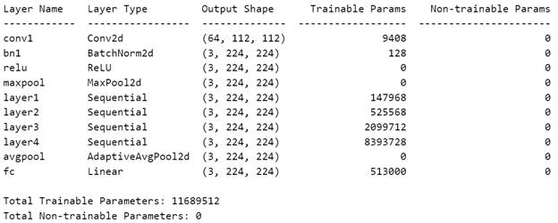
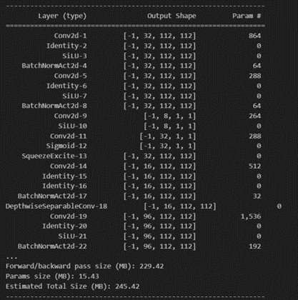

# EE541_Project - Image Classification of American Sign Language
Final project for:

Course title: EE 541 – Computational Introduction to Deep Learning

University: University of Southern California (USC)

Instructor: Dr. Brandon Franzke

Semester: Spring 2024

Student Team: Abdus Saboor Dar, Henry Chen

# Repository Structure
This repository contains 2 jupyter notebook files, one for each model that we implemented (Resnet-18 and EfficientNet-B0). To run the notebooks, the dataset shown below is all that is needed.

# Required Packages
- [PyTorch](https://pytorch.org/) 
- [Torch-Summary](https://pypi.org/project/torch-summary/)
- [Matplotlib](https://matplotlib.org/)
- [Pandas](https://pandas.pydata.org/)
- [Numpy](https://numpy.org/)
- [Sklearn](https://scikit-learn.org/stable/)
- [Timm]https://timm.fast.ai/

# Dataset
The dataset used for this project is available on Kaggle as the [ASL Alphabet](https://www.kaggle.com/grassknoted/asl-alphabet) Dataset.

## About the Dataset
The data set is a collection of images of alphabets from the American Sign Language, separated in 29 folders which represent the various classes.
- The training data set contains 87,000 images which are 200x200 pixels. There are 29 classes, of which 26 are for the letters *"A"* through *"Z"* and 3 classes for *"SPACE"*, *"DELETE"* and *"NOTHIN"*.
- The test data set contains a mere 29 images, to encourage the use of real-world test images.

# Model
We used 2 forms of CNNs: Resnet-18 and EfficientNet-B0

## Resnet-18 Architecture:

## EfficientNet-B0 Architecture:

# Parameters
For Resnet:
- Batch size: 128
- Optimiser: SGD
- Learning Rate: Initially 0.01, reduced using 'ReduceLROnPlateau' Pytorch Function
- 30 Epochs total
  
For EfficientNet:
- Batch size: 32
- Optimiser: Adam
- Criterion: CrossEntropyLoss
- Data Shuffle - True for Training, False for Validation and Test Set
- Learning Rate: Initially 0.01, reduced using 'ReduceLROnPlateau' Pytorch Function
- 5 Epochs total

# Compute Needs:
Our algorithm was run on Kaggle which offered various accelerators to use. We opted for the GPU T4 x2 option. This allowed us to run 2 GPUs in parallel to speed up training. Overall, training and testing on the entire daset took roughly ~70 mins

# Model Size:
Resnet-18: ~50 Mb
EfficientNet-B0: ~50 Mb

# Results
Our final model gave us:
- Accuracy in the training data-set: 99.99%. 
- Accuracy in the validation data-set: 99.99%.
- Accuracy in the testing data-set: 99.98%. 

- Accuracy on third party data: 34.53%
